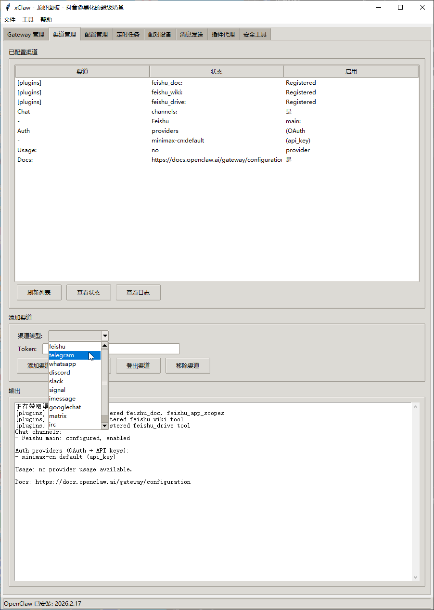

# xClaw

<p align="center">
  <strong>OpenClaw 图形化工具</strong><br>
  <strong>新手小白的福音！</strong><br>
  几乎涵盖了所有终端命令，帮你轻松驾驭龙虾！
</p>

<p align="center">
  <a href="#功能特性">功能特性</a> •
  <a href="#安装">安装</a> •
  <a href="#使用方法">使用方法</a> •
  <a href="#截图预览">截图预览</a> •
  <a href="#许可证">许可证</a>
</p>

---

## 功能特性

### 🚀 Gateway 管理
- 一键启动/停止/重启 Gateway 服务
- 系统服务安装与卸载
- 自定义端口和绑定模式 (loopback/lan/tailnet)
- 强制启动与详细日志选项
- 实时日志查看与 Gateway 诊断

### 📢 渠道管理
支持多种消息渠道的统一管理：
- 飞书 (Feishu)
- Telegram
- WhatsApp
- Discord
- Slack
- Signal
- iMessage
- Google Chat
- Matrix
- IRC
- Nostr

功能包括：添加渠道、登录/登出、移除渠道、查看状态与日志

### ⚙️ 配置管理
- 可视化配置文件编辑
- 支持键值对快速设置
- 配置导入/导出
- 快速设置主模型等常用选项

### ⏰ 定时任务
- 创建和管理定时任务
- 启用/禁用任务
- Cron 表达式支持

### 🔗 配对管理
- 查看配对状态
- 一键配对操作
- 配对信息展示

### 💬 消息管理
- 单条消息发送
- 批量消息发送
- 消息模板支持

### 🔌 插件管理
- 插件安装与卸载
- 启用/禁用插件
- 插件列表查看

### 🔒 安全检查
- 一键安全诊断
- 安全报告生成

---

## 安装

### 方式一：直接下载 EXE（推荐新手）

无需安装 Python，下载即用！

1. 前往 [Releases](https://github.com/xhnoob/xClaw/releases) 页面
2. 下载最新版本的 `xClaw.exe`
3. 双击运行即可

> ⚠️ 首次运行可能被杀毒软件拦截，请添加信任或选择允许运行

### 方式二：Python 源码运行

#### 前置要求

- Python 3.6+
- [OpenClaw](https://docs.openclaw.ai/) 已安装并配置

#### 下载运行

```bash
# 克隆仓库
git clone https://github.com/xhnoob/xClaw.git

# 进入目录
cd xClaw

# 运行
python xClaw.py
```

#### 直接下载

```bash
# 下载并运行
curl -O https://raw.githubusercontent.com/xhnoob/xClaw/main/xClaw.py
python xClaw.py
```

---

## 使用方法

1. 确保 `openclaw` 命令已在系统 PATH 中可用
2. **EXE 用户**：双击 `xClaw.exe` 启动
   **源码用户**：运行 `python xClaw.py` 启动
3. 通过标签页切换不同功能模块
4. 在各模块中执行相应的管理操作

---

## 截图预览

| 主界面 | Gateway 管理 |
|:---:|:---:|
|  |  |

---

## 项目结构

```
xClaw/
├── xClaw.py        # 主程序源码
├── dist/
│   └── xClaw.exe   # 打包好的可执行文件
├── assets/         # 截图资源
└── README.md       # 说明文档
```

---

## 相关链接

- 📖 [OpenClaw 官方文档](https://docs.openclaw.ai/)
- 🌐 [作者主页](http://xhnoob.github.io)

---

## 免责声明

本工具仅供学习和研究使用，请谨慎使用本工具，造成的一切后果请自行承担！

---

## 许可证

本项目采用 MIT 许可证。

---

<p align="center">
  Made with ❤️ by <a href="http://xhnoob.github.io">抖音@黑化的超级奶爸</a>
</p>
